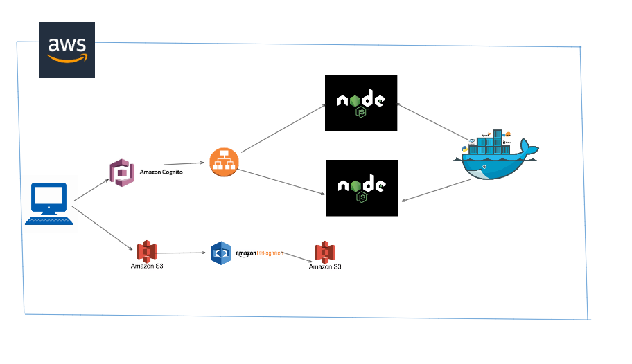
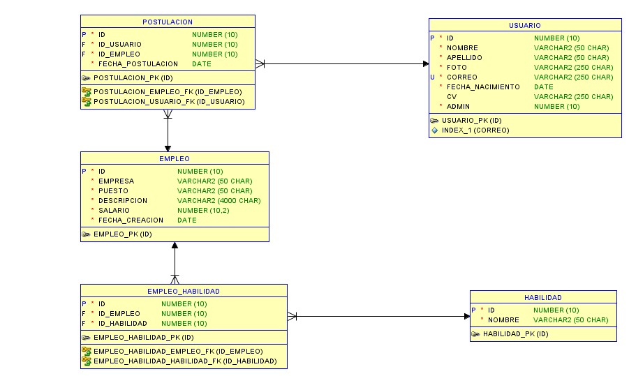
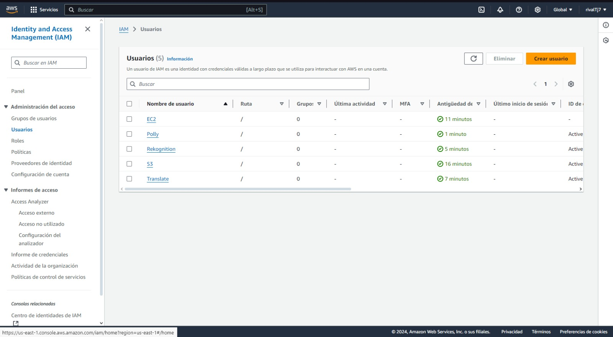
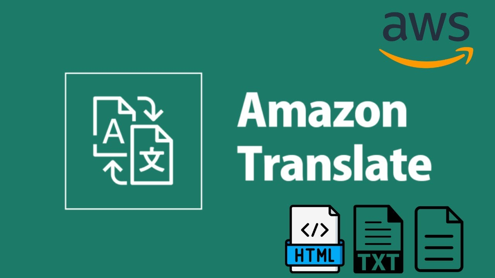

# Hirevision


# Manual Técnico

## ÍNDICE:

- [Hirevision](#-hirevision)
- [Manual Técnico](#manual-técnico)
  - [ÍNDICE:](#índice)
  - [Objetivos](#objetivos)
    - [General](#general)
    - [Específicos](#específicos)
  - [Arquitectura del proyecto](#arquitectura-del-proyecto)
  - [Estructura del código](#estructura-del-código)
    - [Backend](#backend)
      - [NodeJS](#nodejs)
    - [API](#api)
    - [Frontend](#frontend)
      - [Reactjs](#reactjs)
  - [Descripción de los servicios de AWS](#descripción-de-los-servicios-de-aws)
    - [S3](#s3)
      - [Buckets](#buckets)
    - [EC2](#ec2)
    - [Load Balancer](#load-balancer)
    - [RDS](#rds)
    - [IAM](#iam)
    - [Congito](#cognito)
    - [Rekognition](#rekognition)
    - [Translate](#translate)
    - [Polly](#polly)
    - [Docker](#docker)
  - [Conclusiones](#conclusiones)

## Objetivos

### General

Crear una página web que permita la publicación de trabajos y facilite a los usuarios la posibilidad de aplicar a ellos, aprovechando los servicios de AWS para proporcionar una solución eficiente, escalable y segura.

### Específicos

1. Integración de Servicios AWS: Utilizar diversos servicios de AWS como Cognito, S3, y Translate, entre otros, para ofrecer funcionalidades clave como autenticación, almacenamiento y traducción de descripciones de trabajo.

2. Accesibilidad y Usabilidad: Implementar una interfaz intuitiva que permita a los usuarios cargar su CV, aplicar a trabajos, y acceder a herramientas como la traducción de descripciones y reproducción de audio.

3. Escalabilidad: Diseñar una arquitectura que pueda manejar una gran cantidad de usuarios y datos, utilizando servicios como Balanceador de Carga y RDS para garantizar el rendimiento.

## Arquitectura del proyecto



Dicha arquitectura se presenta en donde contamos con un cliente que accede al sitio web de `HireVision` que está alojado en S3, asi tambien cualquier peticion que quiere realizar pasará por un Load Balancer que se encargará de distribuir la carga entre los servidores EC2 que han sido Dockerizados donde aloja uno una API desarrollada con Python y otra una API desarrollada en NodeJS, en donde se encuentran en una zona de disponibilidad, estos servidores se encargan de procesar las peticiones y de acceder a la base de datos que se encuentra en RDS.

## Estructura del código

### Backend

#### NodeJS

<div align="center"></div>

Para la realización de la API desarrollada en NodeJS se utilizó el framework de Express, el cual es un framework de NodeJS que permite la creación de API's de forma sencilla.

Tambien se utilizó la librería de Multer para poder subir archivos a S3, asi mismo tambien se utilizó la librería de Bcrypt para poder encriptar las contraseñas de los usuarios, la librería de UUID para poder generar los id's de los usuarios y la librería de Morgan para poder ver las peticiones que se realizan a la API, asi mismo tambien se utilizó la librería de Cors para poder realizar peticiones desde el cliente.

Para poder conectarse a la base de datos se utilizó la librería de mysql2, y para poder conectarse a S3 se utilizó la librería de aws-sdk.

Para poder ejecutar el proyecto se utilizó el siguiente comando:

```
node app.js
```

Para esto se necesita haber instlado con npm los requerimientos que se encuentran en el archivo [`package.json`](../../Backend/NodeJS/package.json).

El codigo de la API se encuentra en la carpeta [`NodeJS`](./../../Backend/NodeJS) en donde se encuentra la carpeta [`src`](./../../Backend/NodeJS/src) en donde se encuentra el código de la API.

Este proyecto se encuentra corriendo en un servidor EC2 en la zona de disponibilidad `us-east-1a` en los puertos `3000 y 3001`.

### Frontend

#### React

<div align="center"></div>

Para el desarrollo de la interfaz del cliente, se emplearon JavaScript y CSS.
Para poder correr el proyecto en entorno de desarrollo se utilizó el siguiente comando:

```bash
npm install -g create-react-app
npx create-react-app Frontend
cd Frontend
npm start
```

Puede ubicar el código en la carpeta [`Frontend`](./../Frontend/publ) en donde se encuentra la carpeta [`src`](./../../Frontend/src) en donde se encuentra el código de la interfaz.

Este proyecto se encuentra alojado en S3. Y se compone por distintos componentes, pages, etc.

Para el uso de estilos se utilizó la librería de react ReactQuill.

Para el uso de iconos se utilizó la librería de react-icons.

Para el uso de rutas se utilizó la librería de react-router-dom la cual cuenta con las rutas de los distintos componentes en el siguiente [enlace](./../../Frontend/src/index.js).

## Descripción de los servicios de AWS

<div align="center"></div>

Para la realización de este proyecto se utilizó el proveedor de servicios en la nube de AWS, en donde se utilizó los siguientes servicios:

### S3

<div align="center"></div>

Descripción
Amazon S3 es fundamental para el almacenamiento y la entrega de los currículums de los usuarios, así como para la gestión del contenido estático del sitio web, contribuyendo a la escalabilidad y eficiencia general del sistema.

---

### EC2

<div align="center"></div>

Amazon Elastic Compute Cloud (Amazon EC2) fue utilizado en nuestro proyecto para poder alojar los servidores en donde se alojan las API's desarrolladas en Python y NodeJS. Asi mismo tambien se utilizó para recibir las peticiones del Load Balancer y poder acceder a la base de datos de RDS.

#### Instancias

- `EC2-1`: En esta instancia se aloja la API desarrollada en NodeJS, que es ejecutada en el puerto 3000 y se encuentra en la zona de disponibilidad `us-east-1a`.

- `EC2-2`: En esta instancia se aloja la API desarrollada en NodeJS, que es ejecutada en el puerto 3001 y se encuentra en la zona de disponibilidad `us-east-1a`.

#### Creación de Instancias

##### 1. _Instancias_

Para comenzar con la configuración de las instancias, primeramente se accedió a la cuenta - lo que llevó a la página de inicio de la Consola:
Una vez accedido, se ingresó al servicio de EC2:

Se busca en el Panel de Navegación de la izquierda la opción de `Instancias` y se selecciona la opción de `Lanzar Instancia`:

### Load Balancer EC2

<div align="center"></div>

Una de las características de la aplicación es que posee los 2 servidores los cuales se explicaron anteriormente en la sección de `EC2`. Ya que dichos servidores necesitan una manera de verificar su estado, se utilizó lo que es un _`Load Balancer`_. Amazon AWS nos provee con un el servicio de _Elastic Load Balancing_, este es el que distribuye el tráfico entrante de varios destinos al igual que realizar la dicha monitorización del estado de los destinos que se registran y logra enrutar el tráfico a los destinos con buen estado.

### RDS

<div align="center"></div>

Creación de la base de datos en RDS

Para comenzar con la configuración de la base de datos, primeramente se accedió a la cuenta - lo que llevó a la página de inicio de la Consola:

Una vez accedido, se ingresó al servicio de RDS:

Se busca en el Panel de Navegación de la izquierda la opción de `Bases de datos` y se selecciona la opción de `Crear base de datos`, en elegir un metodo de creación se selecciona `Creación estándar`:

Se selecciona el motor de base de datos, en este caso se seleccionó `MySQL`:

Se selecciona la versión del motor de base de datos, en este caso se seleccionó `MySQL 8.0.33`:

En las opciones de plantilla se selecciona `Capa Gratuita`:

Le indicamos el identificador de la base de datos

Se le asigna un nombre de usuario y una contraseña para poder acceder a la base de datos:

Se selecciona el tamaño de la instancia, en este caso se seleccionó `db.t3.micro`:

Se selecciona la zona de disponibilidad, en este caso se seleccionó `us-east-1d`

Le damos acceso al publico y se selecciona el grupo de seguridad que se creó anteriormente `vpc-mysql-semi` la cual tiene el puerto 3306 abierto tanto para el acceso publico como para el acceso privado:

Para la auteuticacion de la base de datos se selecciona `Autenticación con contraseña`:

Se crea la base de datos:

```sql
DROP DATABASE IF EXISTS PROYECTO_SEMI;
CREATE DATABASE PROYECTO_SEMI;
USE PROYECTO_SEMI;

CREATE TABLE USUARIO (
    ID INT PRIMARY KEY AUTO_INCREMENT,
    NOMBRE VARCHAR(50) NOT NULL,
    APELLIDO VARCHAR(50) NOT NULL,
    FOTO VARCHAR(250) NOT NULL,
    CORREO VARCHAR(250) NOT NULL UNIQUE,
    FECHA_NACIMIENTO DATE NOT NULL,
    CV VARCHAR(250),
    ADMIN INT NOT NULL DEFAULT 0 CHECK (ADMIN IN (0, 1)) -- 0: Usuario, 1: Administrador
);

CREATE TABLE EMPLEO (
    ID INT PRIMARY KEY AUTO_INCREMENT,
    EMPRESA VARCHAR(50) NOT NULL,
    PUESTO VARCHAR(50) NOT NULL,
    DESCRIPCION VARCHAR(4000) NOT NULL,
    SALARIO DECIMAL(10, 2) NOT NULL,
    FECHA_CREACION DATE NOT NULL
);

CREATE TABLE HABILIDAD (
    ID INT PRIMARY KEY AUTO_INCREMENT,
    NOMBRE VARCHAR(50) NOT NULL,
);

CREATE TABLE EMPLEO_HABILIDAD (
    ID INT PRIMARY KEY AUTO_INCREMENT,
    ID_EMPLEO INT NOT NULL,
    ID_HABILIDAD INT NOT NULL,
    FOREIGN KEY (ID_EMPLEO) REFERENCES EMPLEO(ID),
    FOREIGN KEY (ID_HABILIDAD) REFERENCES HABILIDAD(ID)
);

CREATE TABLE POSTULACION (
    ID INT PRIMARY KEY AUTO_INCREMENT,
    ID_USUARIO INT NOT NULL,
    ID_EMPLEO INT NOT NULL,
    FECHA_POSTULACION DATE NOT NULL,
    FOREIGN KEY (ID_USUARIO) REFERENCES USUARIO(ID),
    FOREIGN KEY (ID_EMPLEO) REFERENCES EMPLEO(ID)
);
```

# Modelo ER

<br>



<br>

### IAM

<div align="center"></div>

Para poder realizar la conexión entre los servicios de AWS se utilizó IAM, en donde se crearon distintos roles para poder acceder a los distintos servicios. Asi mismo tambien se crearon distintos usuarios para poder acceder a los distintos servicios dependiendo del rol que desempeñaran en el desarrollo. A si mismo a cada desarrollador se le asigno un usuario con un rol especifico para poder acceder a los servicios que necesitaban para el desarrollo.

Se crearon los siguientes usuarios IAM



### Congnito

<div align="center"></div>

Amazon Cognito será utilizado para registrar a los usuarios. Esta herramienta enviará una notificación para que revisemos nuestro correo al confirmar la creación del nuevo usuario, facilitando así la gestión de identidades y el acceso seguro a las aplicaciones.

### Rekognition

<div align="center"></div>

Amazon Rekognition se utilizará para analizar los currículums de los interesados en aplicar a las plazas de empleo. Esta herramienta permite identificar y extraer información relevante de los documentos, facilitando así el proceso de selección y asegurando una evaluación más eficiente de los candidatos.

### Translate

<div align="center"></div>

Amazon Translate se utilizará para traducir todo lo relacionado con el empleo. Esta herramienta proporciona traducciones precisas y rápidas, facilitando la comprensión de documentos y comunicaciones en diferentes idiomas, lo que resulta esencial para una comunicación efectiva en un entorno laboral diverso.

### Polly

<div align="center"></div>

Amazon Polly se utiliza para generar audio a partir de texto, permitiendo escuchar un resumen de los empleos que podrían interesarnos. Esta herramienta de conversión de texto a voz ofrece una experiencia auditiva envolvente y accesible, facilitando la revisión de oportunidades laborales de manera eficiente y práctica.

### Docker

<div align="center"></div>

Para implementar la dockerización de dos backends en Amazon EC2, se utilizó Docker, que permite empaquetar aplicaciones y sus dependencias en contenedores. Esto facilita la gestión y el despliegue de las aplicaciones en entornos de producción. Se configuraron imágenes específicas para cada backend, asegurando así que ambos puedan ejecutarse de manera eficiente y aislada en instancias de EC2.

## Conclusiones

1. Automatización de procesos clave: El uso de Amazon Polly para convertir el título del puesto a audio mejora la accesibilidad de la plataforma, permitiendo a los usuarios escuchar las ofertas de trabajo en lugar de solo leerlas. Esta característica es especialmente útil para personas con discapacidades visuales o que prefieren la entrada auditiva.

2. Despliegue eficiente de la API: Al utilizar Docker para la implementación de la API, garantizamos un entorno de ejecución consistente y fácilmente replicable, lo que facilita el desarrollo y mantenimiento. Docker permite a los equipos desarrollar, probar y desplegar de manera ágil, eliminando las diferencias entre entornos de desarrollo y producción.

3. Base de datos segura y escalable: La implementación de Amazon RDS como solución de base de datos permite gestionar los datos de los usuarios de manera eficiente, ofreciendo escalabilidad automática, backups automáticos y mejoras en el rendimiento. Esto asegura que la plataforma puede manejar un número creciente de usuarios y solicitudes sin comprometer la velocidad o seguridad.

4. Seguridad mejorada: Al integrar Cognito para la autenticación de usuarios, se garantiza un nivel elevado de seguridad, asegurando que solo usuarios autorizados puedan acceder a funciones críticas como la carga de CV y la aplicación a puestos.
