## Bienvenido a:

# Manual de Usuario

## ÍNDICE#️⃣:

1. [Objetivos](#objetivos)
2. [Explicación y Descripción de la aplicación](#explicación-y-descripción-de-la-aplicación)
3. [Cómo utilizar la aplicación](#cómo-utilizar-la-aplicación)

   - [Usuario Administrador](#usuario-administrador)

     - [Ingresar a la plataforma](#1-ingresar-a-la-plataforma)
     - [Crear Empleos](#crear)
     - [Personas postuladas](#postulados)

   - [Usuario Subscriptor](#usuario-subscriptor)

     - [Registro](#2-registro)
     - [Home](#3-home)

## Objetivos:

### General:

Proporcionar a los usuarios una guía completa y accesible que les permita interactuar eficientemente con la aplicación, desde el registro y carga de currículums hasta la utilización de las herramientas de análisis y traducción, asegurando una experiencia fluida y satisfactoria.

### Objetivos Específicos

- Orientar a los usuarios en el proceso de registro y autenticación: Instruir a los usuarios sobre cómo crear una cuenta, iniciar sesión y gestionar su perfil utilizando Amazon Cognito, garantizando un acceso seguro a la aplicación.

- Facilitar la carga y gestión de currículums: Proporcionar pasos detallados para que los usuarios puedan cargar sus currículums en Amazon S3, incluyendo recomendaciones sobre formatos y tamaños de archivo, así como instrucciones sobre cómo revisar y actualizar sus documentos.

- Explicar el uso de las herramientas de análisis y traducción: Instruir a los usuarios sobre cómo aprovechar las funcionalidades de análisis de currículums (Amazon Comprehend), traducción de descripciones de empleo (Amazon Translate) y generación de audio (Amazon Polly), mejorando así su comprensión y accesibilidad en el proceso de búsqueda de empleo.

## Explicación y Descripción de la aplicación

Se presenta la plataforma denominada "Hirevision", una aplicación en la nube - accesible desde cualquier navegador, el usuario suscriptor de Hirevision podrá disfrutar de funciones tales como:
Registrarse, Iniciar sesión, , modificación de la cuenta, crear empelo, ver empleo, cargar cv, ver postulados.

## Cómo utilizar la aplicación

### _Usuario Administrador_

#### 1. Ingresar a la plataforma administrador

Si posee cuenta, podrá ingresar con su correo electronico y credenciales de administarador.

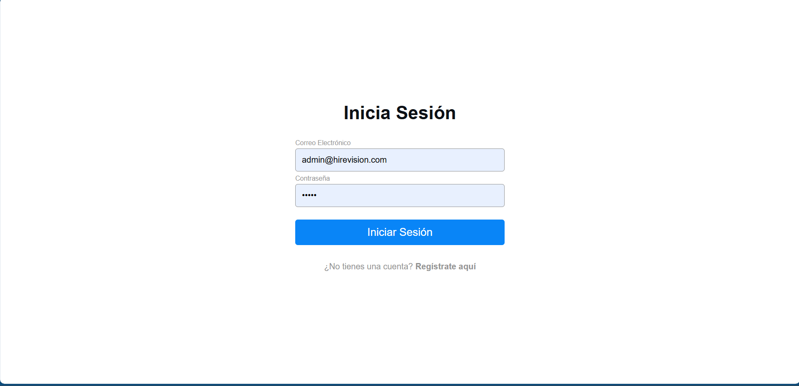

#### 2. Crear Empleos

Si posee crear nuevos empleos respecto a las habilidades de los postulantes.

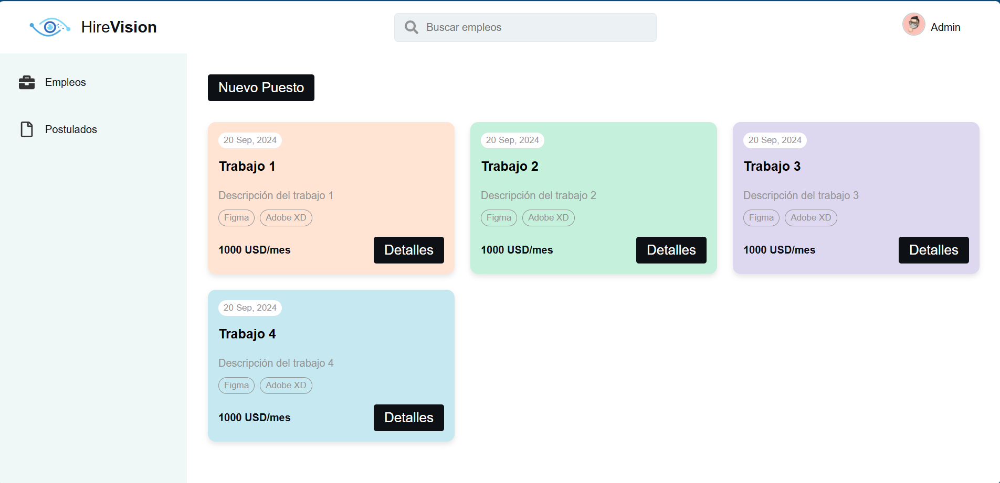
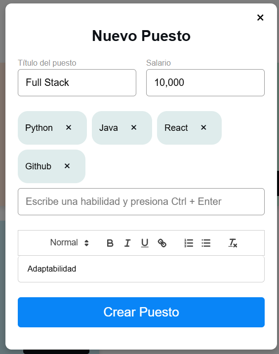

#### 3. Ver postulados

Se podrá ver los usuarios postulados a los empleos y el porcentaje de conocimiento que tienen respecto a las tecnologias.

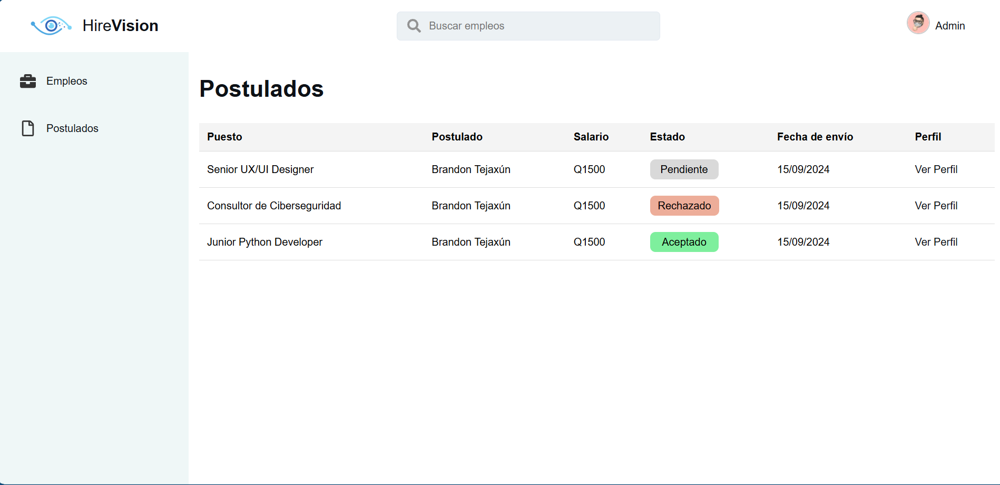
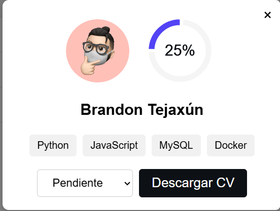

### _Usuario Subscriptor_

#### 1. Ingresar a la plataforma/crear usuario

Si posee cuenta, podrá ingresar con su correo electrónico y contraseña, de lo contrario, deberá registrarse.

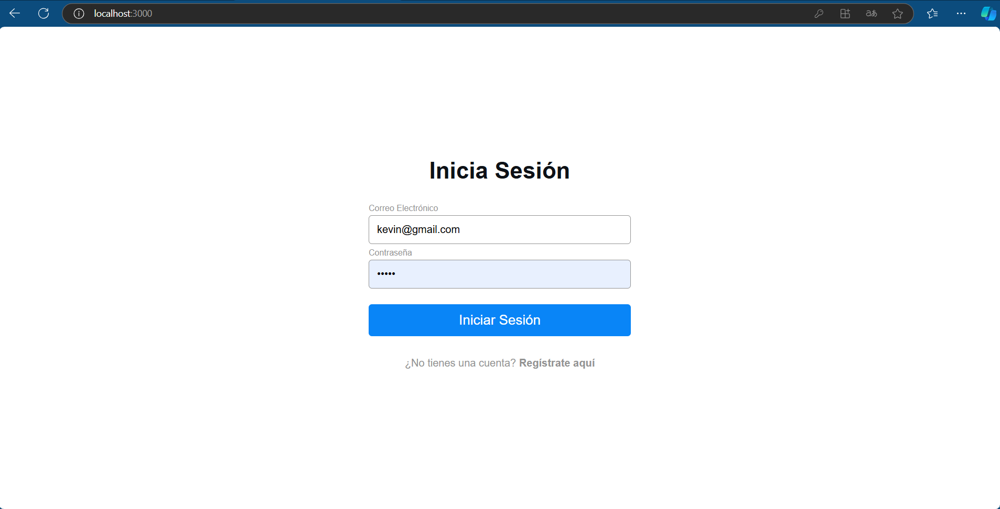

#### 2. Registro

Para poder registrarse, en la pantalla de inicio deberá de hacer click en la sección de **Regístrate aquí**. Una vez hecho esto, se le presentará la siguiente pantalla:
 
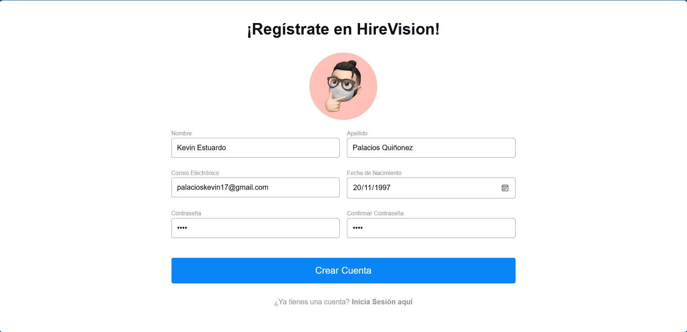

#### 3. Código de Confirmación

Una vez hayas realizado el proceso de crear cuenta, recibiremos un código de confirmación y debemos ingresar ese código:
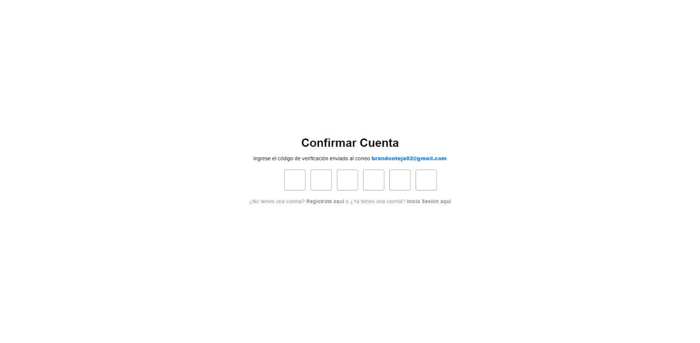

#### 4. Validación

Una vez hayas realizado el proceso confirmación se realizará la validación y podrás iniciar sesión:
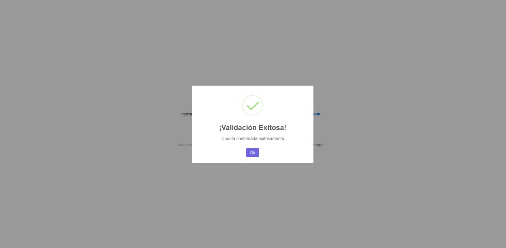

#### 5. Cargar CV

Una vez hayas iniciado sesión en el apartado de mi perfil, puedes ir a editar y cargar tu CV arrastrandolo o dando click:

#### 6. Empleos disponibles

Ver empleos Disponibles:
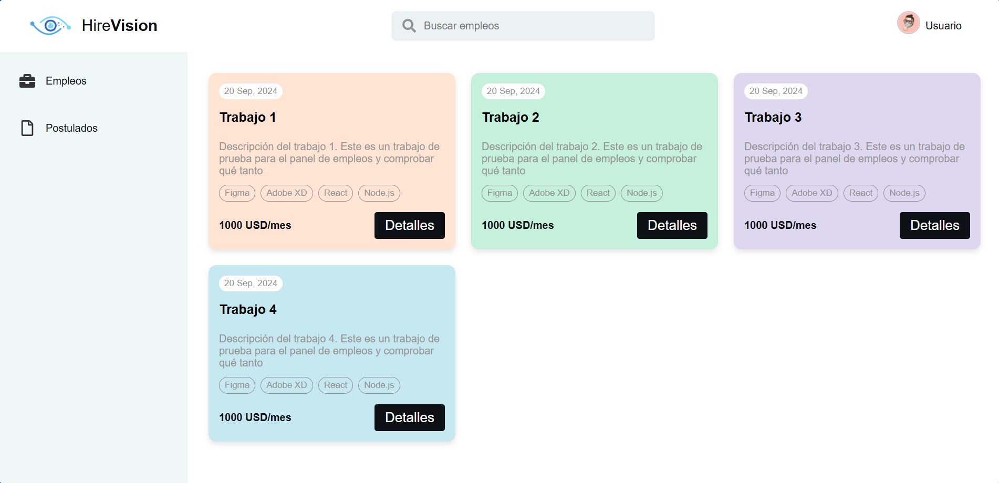

#### 7. Detalles

Podrás visualizar la descripción del empleo, traducirlo y Esuchar su descripción:
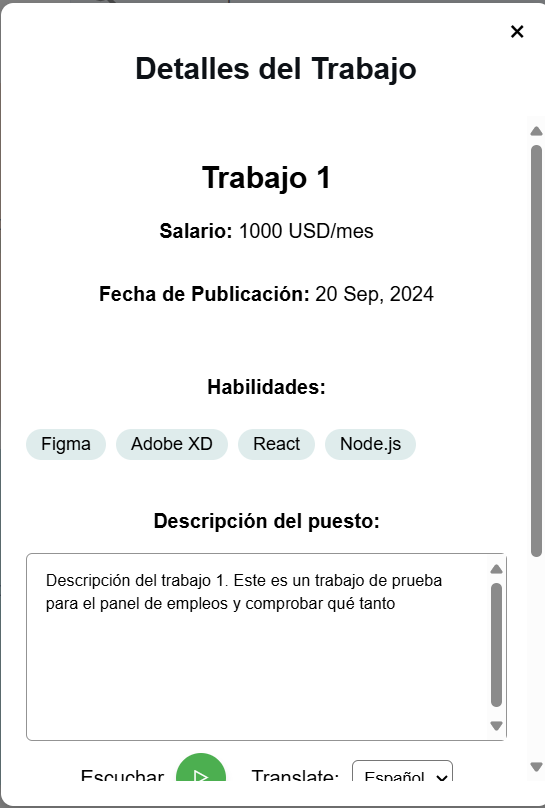

#### 6.Estado Postulado

En este espacio se pueden visualizar los trabajos donde seras aceptado al cumplir con los requisitos:
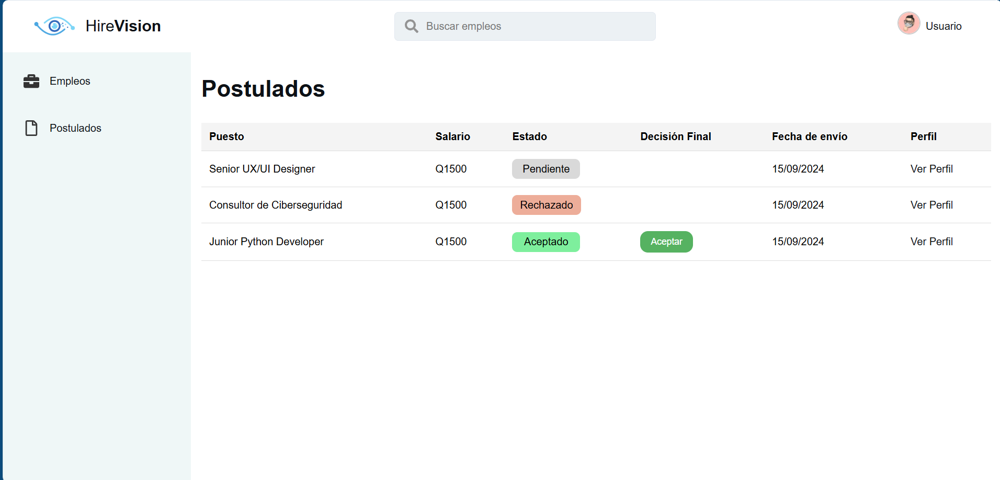
